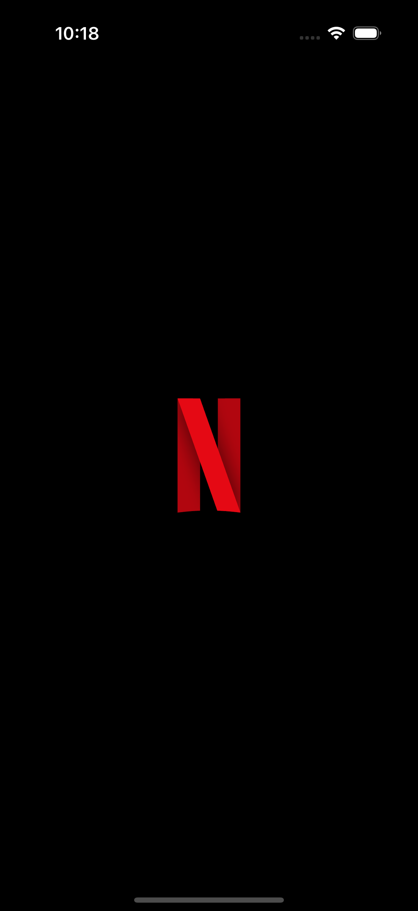
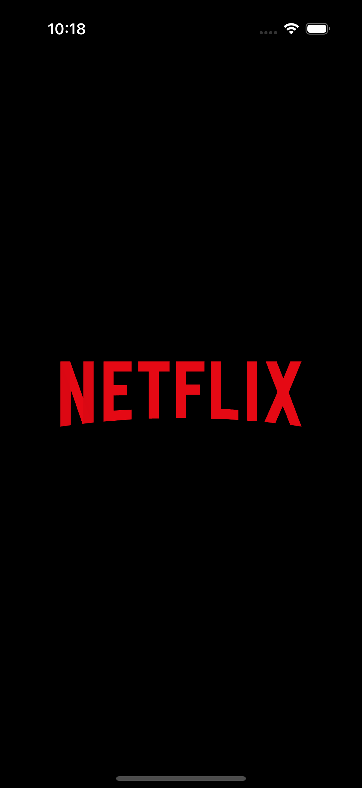
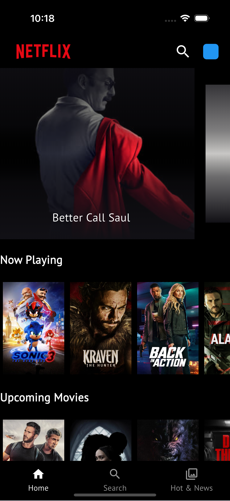
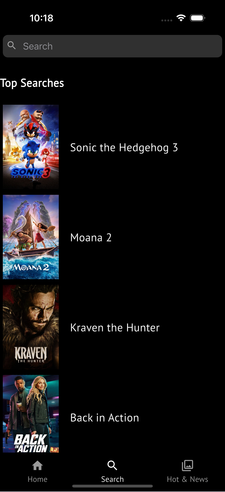
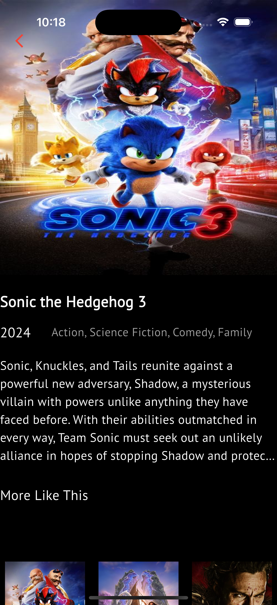
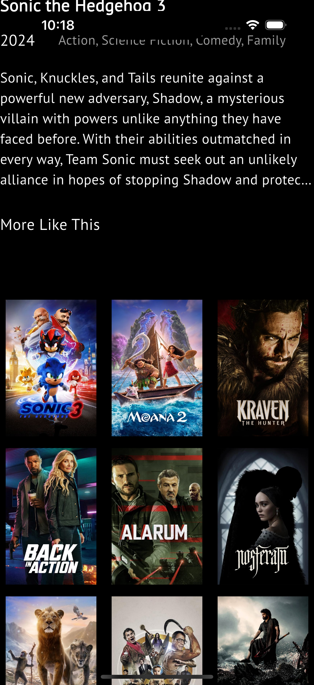
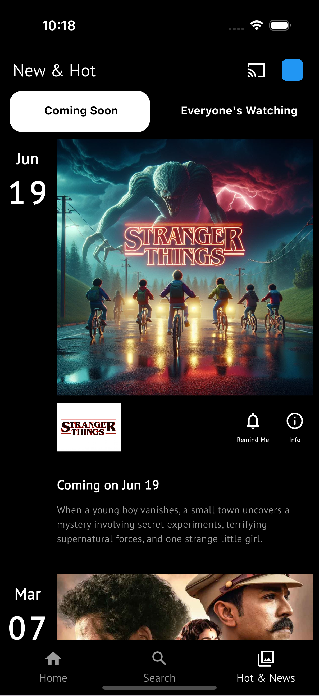
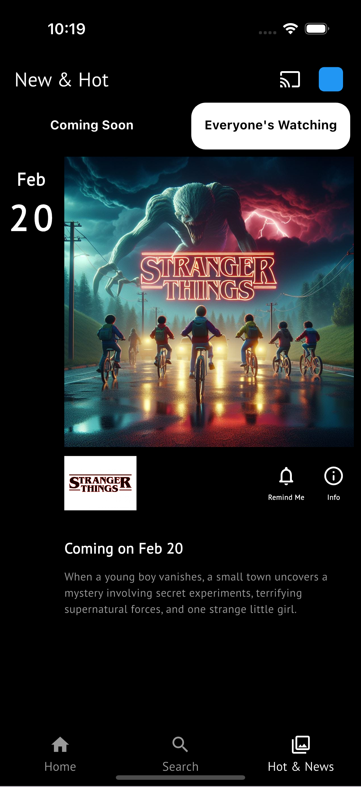

# Netflix UI-Clone App

This is a simple Flutter application designed for Chatting.

## Getting Started

1. **Streaming Functionality**: Implement a robust streaming service that allows users to watch movies and TV shows seamlessly. This includes features like adaptive bitrate streaming to optimize video quality based on the user’s internet connection.

2. **User Authentication and Profiles**: Allow users to create accounts and set up personalized profiles. This enables tailored recommendations and maintains individual watch histories, making it easier for users to track their favorite content.

3. **Content Browsing and Search**: Provide a visually appealing interface for browsing and searching for content. Include categories, genres, and filters to help users discover new shows and movies easily.

4. **Watchlist and Recommendations**: Integrate a watchlist feature for users to save content for later viewing. Implement a recommendation engine that suggests movies and shows based on users’ viewing habits and preferences.

5. **Responsive Design and Cross-Platform Support**: Ensure the app is responsive and works smoothly across various devices, including web browsers, mobile devices, and smart TVs, offering a consistent user experience regardless of the platform.

## APK File

You can download the APK file for the app using the link below:

[Download APK](https://drive.google.com/file/d/1mskts1_p189tBmnQbctwo8YnL158ydju/view?usp=sharing)

## App Screenshot

Here are the screenshots of the app:

